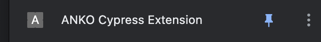

# Cypress Logs Extension
Hides all cypress list items except 

## How to install
1. Clone repository
2. Run Cypress Test
3. Click on plugin icon 
4. Click manage plugins menu item 
5. Click enable Developer Mode 
6. Click Load Unpacked button 
7. Select folder cloned folder
8. Click on plugin button again
9. Pin extension 
10. Click on extension icon (it should filter logs)
